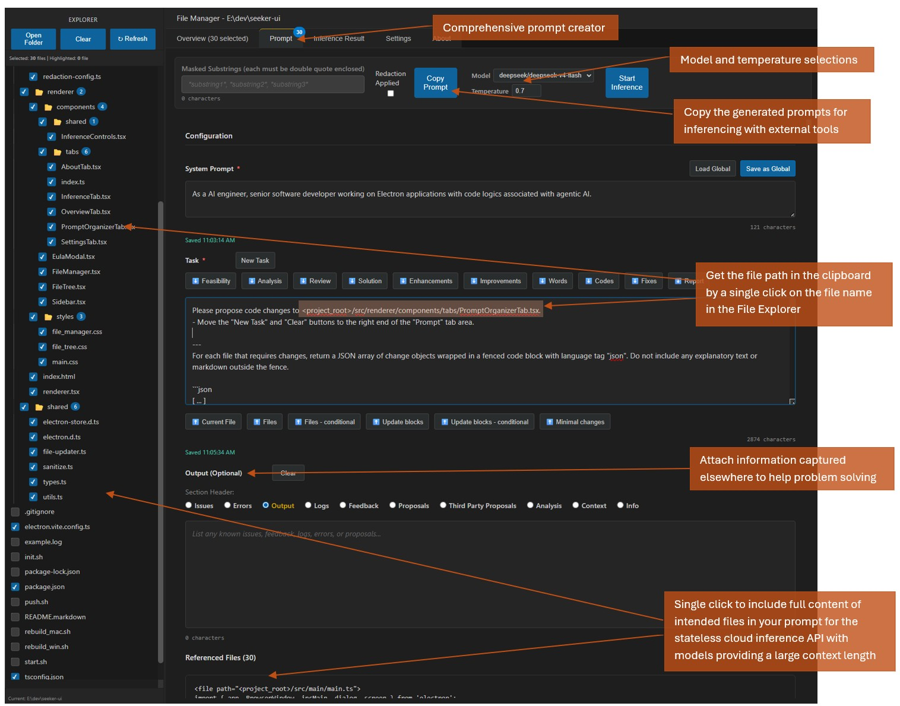
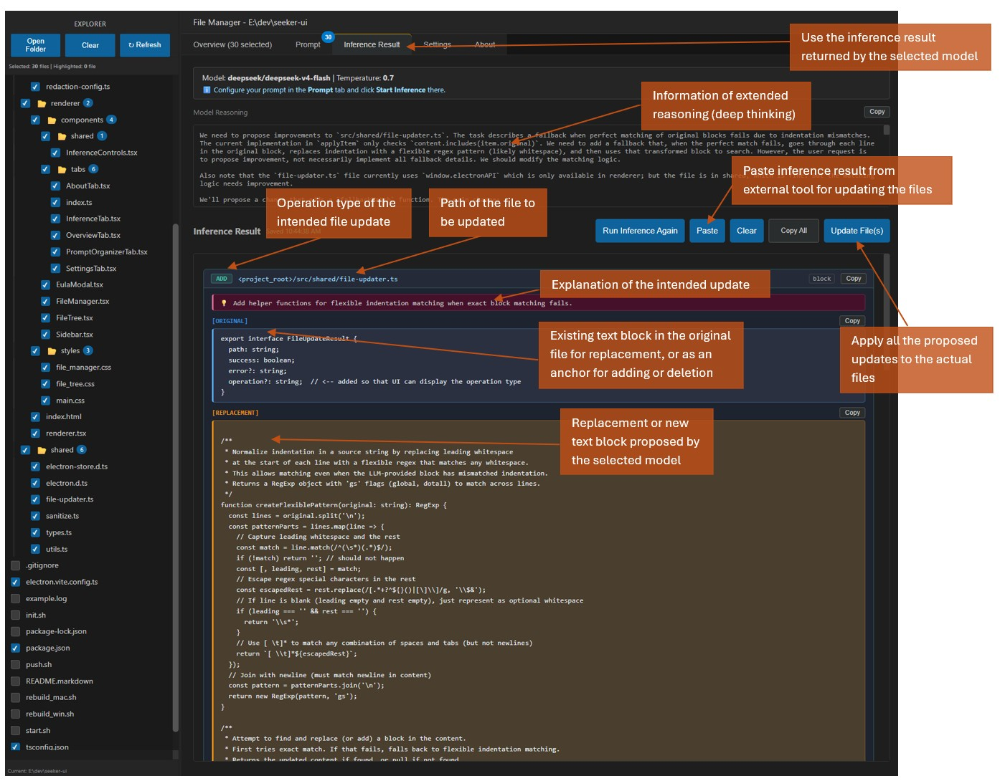

# Seeker UI – The Visual AI Assistant

**Future Roadmap**

- Add **Venice API** support alongside the existing **OpenRouter API** integration.
- Replace the current inference orchestration with an **agentic orchestration** system, enabling multi-node workflows.
- Integrate a remote **web search and scraping MCP server** to provide richer contextual information for coding and writing tasks.

## Introduction

Seeker UI is a visual, AI‑assisted workspace for coding and writing projects. It brings together file browsing, structured prompt engineering, and inference results into a single desktop application designed for developers, technical writers, and content creators. Unlike command‑line tools that require memorising flags and juggling separate scripts, Seeker UI offers:

- **A graphical file explorer** with per‑file checkboxes and a live preview.
- **A prompt organiser** that builds structured prompts from your system prompt, task description, issues, and selected files – all saved per project folder.
- **One‑click inference** with model selection and temperature – no curl commands, no JSON formatting by hand.
- **Inline block‑based updates** that let you review AI‑proposed changes before applying them to your files.
- **Local‑first storage** – your API keys, prompts, and folder states stay on your machine, with optional redaction to protect sensitive data.





This document guides you through every step, from the first launch to applying AI‑generated changes.

#### Installing on Windows

Windows may display a "Windows protected your PC" warning during installation. This occurs because the binary is not digitally signed. To avoid the high recurring costs of Certificate Authority subscriptions and the overhead of maintaining a hardware security module for a personal open-source project, I have chosen not to apply code signing at this time. You can proceed by clicking "More info" and then "Run anyway."

#### Installing on macOS

Applications downloaded outside the App Store are often blocked by Gatekeeper. Due to the cost of maintaining an Apple Developer Program membership and the complexity of automated notarization pipelines for independent developers, this app is not notarized. To run the app, please execute the following command in your Terminal to remove the quarantine attribute:

```bash
xattr -rd com.apple.quarantine /Applications/seeker-ui.app
```

#### Linux Support

There are currently no plans to release a pre-compiled Linux binary. However, the source code is fully compatible with Linux environments. Developers interested in running the app on Linux can build it themselves by following these simple steps:

1. Clone the repository.
2. Run `npm install` to install dependencies.
3. Run `npm run package:linux` to generate an AppImage or distribution-specific package.

---

## 1. First Launch & End‑User License Agreement (EULA)

When you start Seeker UI for the first time, the **EULA modal** (`EulaModal.tsx`) blocks the main interface until you accept or decline the terms.

- **Agree and Proceed** – saves your acceptance in `electron-store` and opens the main window.
- **Deny and Exit** – quits the application.

The EULA covers:
- Disclaimer of liability and “as‑is” use.
- Your responsibility when using third‑party inference providers (OpenRouter).
- Local‑first privacy (no telemetry, analytics, or tracking).
- Open‑source licensing (personal, non‑commercial use; enterprise licensing requires separate agreement).

Once agreed, you will not see the modal again on subsequent launches.

---

## 2. Configuration (Settings)

The **Settings tab** (`SettingsTab.tsx`) lets you configure global, application‑wide settings that are shared across all folders.

| Field                    | Purpose                                                                                                   |
|--------------------------|-----------------------------------------------------------------------------------------------------------|
| **Open Router API Key**  | Your OpenRouter API key (hidden by default, visible when focused). Required for inference.                |
| **Models for Inference** | A comma‑separated list of quoted model names (e.g. `"anthropic/claude-sonnet-4-6", "deepseek/deepseek-v4-pro"`). These populate the model dropdown in the Prompt Organizer. |
| **Models for Validation**| (Currently ineffective – reserved for future validation features.)                                 |

- **Auto‑save** – changes are saved automatically after a short debounce.
- **Import / Export** – you can import or export settings as a JSON file, making it easy to share configurations across machines.

**Tip:** The API key is sent only to OpenRouter; it is never logged or stored outside your local `electron-store`.

---

## 3. Selecting Files (Explorer)

The **Explorer** (`FileTree.tsx`) is the left‑hand sidebar. It displays the file tree of the currently opened folder.

### Opening a Folder
- Click **“Open Folder”** and choose a directory. The last opened folder is remembered across sessions.
- The folder’s state (system prompt, task, issues, inference model, temperature, and inference results) is automatically saved per folder.

### Selecting Files
- Each file has a **checkbox** – check any file to include it in the referenced files section of your prompt.
- **Folders** – checking a folder selects all files inside it recursively. The folder will expand to show its contents.
- **Clear** – deselects all checked files.
- **Refresh** – reloads the directory tree and verifies the existence of previously selected files (invalid selections are removed).

### Previewing a File
- Hover over a file and click the **eye icon (👁)** to open a read‑only preview overlay.
- Click the **✕** on the preview to close it.

**Selection counts** are displayed at the top of the Explorer and are reflected in the **Overview** tab.

---

## 4. Building Prompts (Prompt Organizer)

The **Prompt** tab (`PromptOrganizerTab.tsx`) is where you craft the instructions that will be sent to the AI. It is divided into three main sections:

### 4.1 System Prompt
- Defines the assistant’s role, tone, and constraints (e.g., “You are a senior software engineer…”).
- **Required** – the tab will not allow copying the prompt or running inference if empty.
- **Global Default** – you can save the current system prompt as the global default, and later load it into any folder.
- **Auto‑saved** per folder.

### 4.2 Task
- Describes the specific task or objective (e.g., “Refactor the `calculate` function to use optional chaining”).
- **Required** – must be filled for inference.
- **Prepend / Append buttons** – quickly add common task prefixes (e.g., “Please explore feasibility”) or structural instructions (e.g., “Update blocks – conditional”).
- **New Task** clears the task field.

### 4.3 Issues (Optional)
- A free‑form field for listing known issues, errors, logs, feedback, or any additional context.
- You can choose a **section header** (e.g., “Issues”, “Errors”, “Proposals”) – this determines the XML tag used when building the prompt.
- **Clear** empties the field.

### 4.4 Referenced Files
- Displays the content of all selected files (from the Explorer). Each file is wrapped in an XML‑like `<file path="...">` tag.
- The content is automatically **sanitised** (HTML entities decoded) and, if the **“Redaction Applied”** checkbox is ticked, **redacted** using a configurable set of policies (API keys, emails, IPs, etc.).
- **Custom Masked Substrings** – you can define a list of double‑quoted substrings that will be replaced with `[SENSITIVE]` in the prompt. This is useful for hiding proprietary names or internal identifiers.

### 4.5 The Prompt Structure
When you click **“Copy Prompt”**, the app builds a combined prompt with the following structure (after applying sanitisation, custom masking, and optional redaction):

```
<system_prompt content="System Prompt">
  [your system prompt]
</system_prompt>
<user_prompt content="User Prompt">
  <task content="Task">
    [task]
    ---
    **Please nominate missing or unselected but still anticipated files if there are any**
  </task>
  ---
  <issues content="Issues">   (if provided; tag name and content attribute depend on the selected header)
    [issues]
  </issues>
  ---
  <referenced_files content="Referenced Files">          (if files are selected)
    <file path="...">...</file>
    ...
  </referenced_files>
</user_prompt>
```

The **“Copy Prompt”** button copies this full structured prompt to your clipboard. You can then paste it into any external LLM interface (e.g., OpenAI Playground, OpenRouter Chat, etc.).

---

## 5. Choosing Model and Temperature

At the top of the **Prompt** tab, next to the “Copy Prompt” button, you’ll find the inference controls (`InferenceControls.tsx`):

- **Model dropdown** – populated from the “Models for Inference” setting. Select the model you want to use.
- **Temperature** – a numeric input (0.0 – 2.0) controlling randomness.
- These values are saved per folder and will be restored when you reopen the folder.

**Note:** Some models require specific temperature settings when deep‑thinking is enabled – the app automatically adjusts the temperature when it detects a compatible model.

---

## 6. Running Inference and Reviewing Results

Once you have configured your system prompt, task, selected files, and chosen a model/temperature, you can run inference:

1. In the **Prompt** tab, click **“Start Inference”**.
2. The app will:
   - Build the prompt (applying redaction if enabled).
   - Send it to OpenRouter using the selected model.
   - Display a “running” status.
3. Upon completion, the **Inference Result** tab will automatically open, showing:
   - The assistant’s **reasoning** (if returned by the model).
   - The main **inference result** – the assistant’s reply.

The inference result is parsed for **block replacement items** – specially formatted JSON objects that describe file modifications (see Section 7). These blocks are rendered with distinct visual cues (original vs replacement, operation type, etc.).

### Stopping Inference
While inference is running, a **“Cancel Inference”** button appears in the Inference tab. Click it to abort the request.

### Re‑running Inference
The **“Run Inference Again”** button re‑sends the exact same prompt with the current model and temperature – useful for iterative refinement.

---

## 7. Copying Prompts to External Services & Pasting Responses Back

Seeker UI is built to work seamlessly with **outside inference services**, such as OpenRouter’s web chat, ChatGPT, Claude, etc.

### Copying the Prompt
- Use the **“Copy Prompt”** button in the Prompt tab to copy the full structured prompt to your clipboard.
- You can now paste it into any external chat interface or API client.

### Pasting a Response
Once you receive a response from an external service (or from any other source), you can bring it back into Seeker UI:

1. Copy the response text (including any JSON code fences) to your clipboard.
2. In the **Inference Result** tab, click the **“Paste”** button.
3. The app will:
   - Read your clipboard content.
   - Parse it for fenced JSON blocks (language “json”).
   - Display the pasted text in the result area.
   - If valid block replacement items are found, the **“Update File(s)”** button becomes enabled.

This allows you to use any AI service you prefer and still leverage Seeker UI’s file‑update workflow.

---

## 8. Applying Block Updates to Files

When the inference result (or pasted response) contains a valid JSON array of block replacement items, you can apply those changes to your files.

### Block Replacement Items Format
Each object in the JSON array must have:

- `"path"` – relative path prefixed with `<project_root>/`.
- `"op"` – one of `"add"`, `"replace"`, or `"delete"`.
- `"reason"` – explanation of the change (displayed in the UI).
- `"is_full_file"` – boolean; `true` means the operation applies to the entire file.
- `"original"` – string or `null`; the exact block to be replaced/deleted (for partial operations).
- `"replacement"` – string or `null`; the new content (for add/replace, `null` for delete).

The UI renders each block with the original and replacement side‑by‑side, along with a **copy** button for each snippet.

### Applying Updates
1. With a valid set of blocks in the result area, click **“Update File(s)”**.
2. A confirmation prompt appears. Click **“OK”** to proceed.
3. The app will:
   - For each block, attempt to locate the file, read it, find the `original` block, and perform the specified operation.
   - Write the updated content back to disk.
4. A **File Update Summary** popup shows the result for each file (success/failure, operation type, and any errors).

**Important:** Before applying AI‑generated changes, ensure all uncommitted changes are committed to your source control system (e.g., Git) or create a backup of your project files. The app does not provide an undo function for file modifications, so taking these precautions protects your work.

---

## Final Notes

- **All settings, prompts, and inference results are stored locally** in `electron-store`. No data is sent anywhere except to OpenRouter when you explicitly run inference.
- The app is **open‑source and free for personal, non‑commercial use**. For enterprise or bulk usage, please contact the authors for licensing terms.
- **Security** – the app includes built‑in redaction for common secrets and custom masking for user‑defined substrings. However, you are ultimately responsible for reviewing what you send to third‑party APIs.

Enjoy using Seeker UI – the visual AI assistant that puts you in control of your code, your prompts, and your workflow.