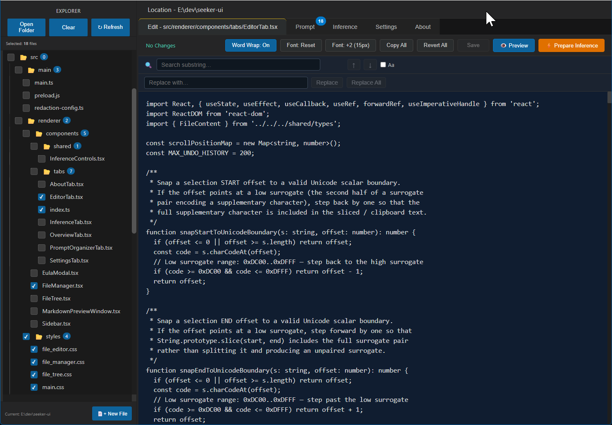
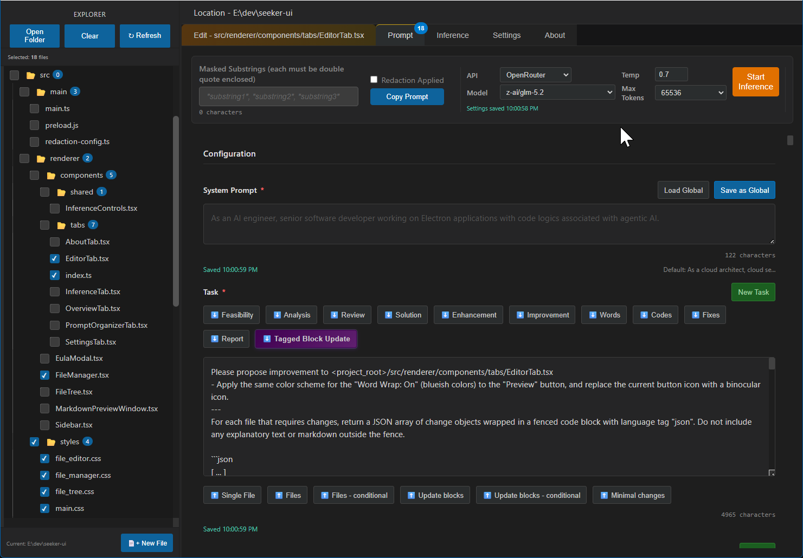
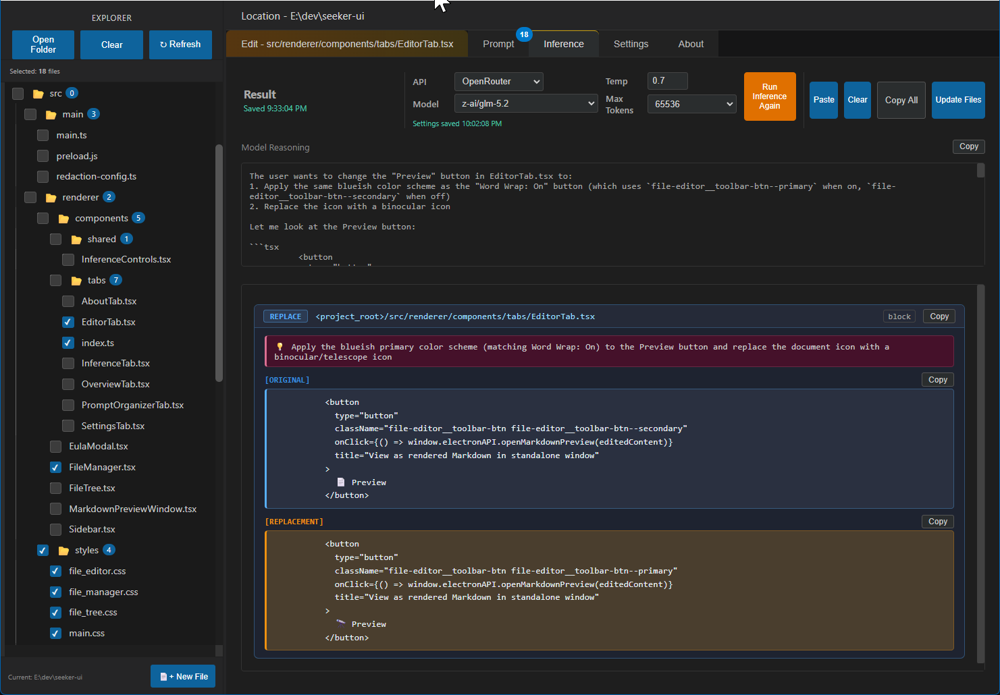
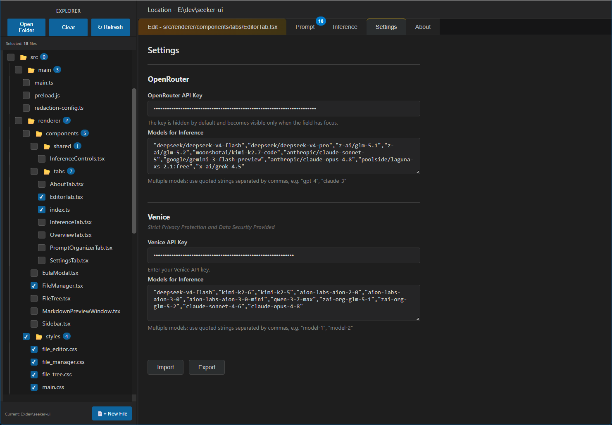

# Seeker UI – The Visual AI Workspace

**Current Version: 0.9.2**  |  **Website: [seeker-ui.app](https://seeker-ui.app/)**

## Recent Updates

The latest release delivers substantial capability and polish across the workspace:

- **High-Performance File Editor**: A full-featured code editor with always-visible search and replace, undo/redo, word wrap, live Markdown preview, Unicode-safe copy/cut/paste, font controls, and unsaved-changes protection—designed for rapid, confident iteration alongside your AI workflow.
- **Venice API Integration**: Secure, privacy-oriented inference endpoints are now available alongside OpenRouter.
- **Highly Configurable Inference Context with File Explorer**: Fine-grained control over what each model sees—recursive folder selection, per-file checkboxes, binary file detection, favorites, path utilities, custom masking and redaction, and structured context tags—so every inference run receives precisely the intended context.
- **UI Overhaul**: A refined, professional workspace organized across four dedicated tabs: File Editor, Prompt Organizer, Inference, and Settings.

**Future Roadmap**

- Connect Seeker UI to **external knowledge sources (MCP servers)** so that each inference run can pull in relevant background information automatically — documentation, notes, or any retrieval service you configure — before sending your prompt to the model. You stay in control: a confirmation step appears every time, you choose which sources to query, and you can skip retrieval entirely with one click. The extra API cost this adds is **fixed and visible before you confirm**: one retrieval step runs, its output appears in full in your assembled prompt, and inference proceeds — the cost for that run is known before it starts. This is **a deliberate design choice over fully automated "agentic" approaches**, where the model decides how many follow-up calls to make and costs can multiply across several unpredictable back-and-forth rounds. Here, you always know what you are paying for.
- Add **session memory** so Seeker UI can carry a compact rolling summary of your recent exchanges into each new inference, without you having to re-paste previous results. The summary is kept deliberately short — it adds a small, predictable amount to each prompt rather than growing without bound, keeping your per-run cost forecastable.
- Introduce a dedicated remote **web search and scraping MCP server** to provide enriched, real-time context for coding (documentation lookup) and writing (live web content) tasks, again at a single, auditable retrieval cost per run.

## Introduction

Seeker UI is a visual, AI-assisted desktop workspace for coding and writing projects. It unifies file browsing, structured prompt engineering, and inference results in a single application for developers, technical writers, and content creators. Rather than relying on command-line tools and separate scripts, Seeker UI provides:

- **Configurable LLM inference context via the File Explorer** – recursive folder selection, binary detection, favorites, and per-folder state let you decide exactly which files and content feed into prompts, including comprehensive multi-area contexts (for example, combining backend and front-end source code in a single run). The selected files appear in the Referenced Files section of the **Prompt Organizer** tab (see screenshot below).
- **A production-ready File Editor** – always-visible search and replace, undo/redo, word wrap, font sizing, Markdown preview, Prepare Inference handoff, and safe save/revert workflows so you edit with confidence next to your AI pipeline. See the **File Editor** tab screenshot in the Tour of Major Tabs below.
- **A Prompt Organizer** that assembles structured prompts from your system prompt, task description, optional inference context, and selected files—all persisted per project folder. See the **Prompt Organizer** tab screenshot in the Tour of Major Tabs below.
- **One-click inference** with OpenRouter or Venice, including model selection, temperature, and max tokens—without hand-crafted curl commands or manual JSON formatting. Results and reasoning are displayed in the **Inference** tab (see screenshot below).
- **Inline block-based updates** that let you review AI-proposed changes before applying them to your files. These block replacements are rendered in the **Inference** tab with side-by-side original-vs-replacement previews (see screenshot below).
- **Local-first storage** – API keys, prompts, and folder state remain on your machine, with optional redaction and custom masking to protect sensitive data. API keys and model lists are configured in the **Settings** tab (see screenshot below).
- **External-service interoperability** – copy structured prompts into any external LLM interface and paste responses back into Seeker UI to reuse the same file-update workflow. The Paste button in the **Inference** tab (see screenshot below) parses clipboard content for block replacement items.

## Tour of Major Tabs

Four focused tabs keep every stage of the AI-assisted workflow clear:

**File Editor** — Open any file from the Explorer and edit with a high-performance editor: search/replace, undo/redo, word wrap, font size, Markdown preview, and seamless handoff to the Prompt tab via Prepare Inference. This is the production-ready editor described in the Introduction (see *A production-ready File Editor* above). Files checked in the Explorer sidebar automatically appear in the Referenced Files section of the Prompt Organizer tab.



**Prompt Organizer** — Craft system prompts, tasks, optional inference context, and referenced files into a clean structured prompt. Select the API provider (OpenRouter or Venice), model, temperature, and max tokens when you are ready to run inference or copy the prompt. This corresponds to the *Prompt Organizer* and *One-click inference* key points in the Introduction. Use the **Copy Prompt** button to leverage the *External-service interoperability* workflow described above.



**Inference** — Review reasoning and results, cancel or re-run inference, paste responses from external services, and apply block-based file updates with a clear summary. This tab implements the *Inline block-based updates* and *External-service interoperability* features highlighted in the Introduction. The Paste button accepts responses copied from any external LLM interface, and the Update Files button applies reviewed block replacements to disk.



**Settings** — Configure OpenRouter and Venice API keys and model lists, with auto-save plus import/export for sharing configurations across machines. This tab underpins the *Local-first storage* principle described in the Introduction: all keys and preferences are stored locally via `electron-store` and never leave your machine except when you explicitly run inference.



For detailed instructions on how to use the application, please refer to the [User Manual](user_manual.md).

---

## Installation

### Installing on Windows

Windows may display a "Windows protected your PC" warning during installation because the binary is not digitally signed. To avoid the high recurring costs of Certificate Authority subscriptions and the overhead of maintaining a hardware security module for a personal open-source project, code signing is not applied at this time. You can proceed by selecting **More info**, then **Run anyway**.

### Installing on macOS

Applications downloaded outside the App Store are often blocked by Gatekeeper. Due to the cost of maintaining an Apple Developer Program membership and the complexity of automated notarization pipelines for independent developers, this app is not notarized. To run the app, remove the quarantine attribute by executing the following command in Terminal:

```bash
xattr -rd com.apple.quarantine /Applications/seeker-ui.app
```

### Linux Support

There are currently no plans to release a pre-compiled Linux binary. The source code is fully compatible with Linux environments. Developers who wish to run the app on Linux can build it by following these steps:

1. Clone the repository.
2. Run `npm install` to install dependencies.
3. Run `npm run package:linux` to generate an AppImage or distribution-specific package.
